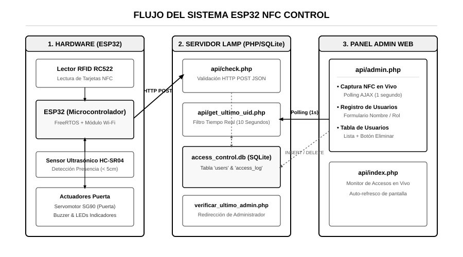
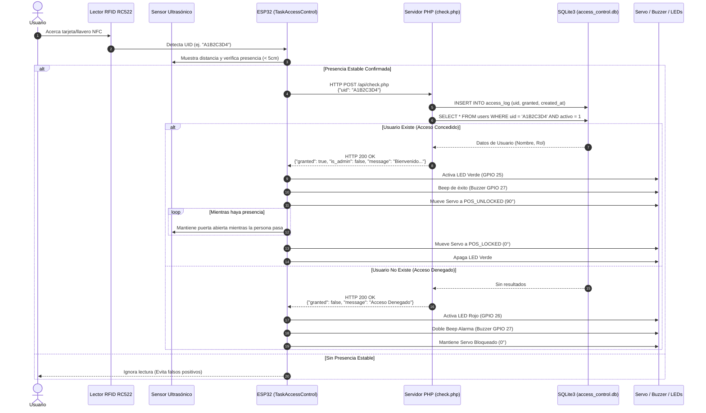
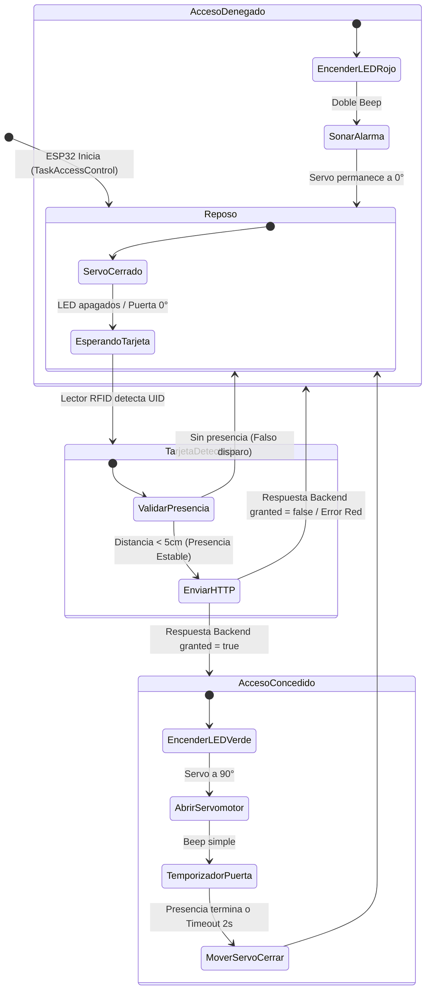

# Diagramas de Flujo y Arquitectura del Sistema

Este documento describe el flujo de funcionamiento completo del sistema **ESP32 NFC Access Control**, incluyendo el microcontrolador ESP32, los sensores/actuadores físicos, el backend en servidor **LAMP (Apache / PHP / SQLite3)** y el **Panel de Administración Web en tiempo real**.

---

## 🎨 Esquema Visual del Sistema



---

## 1. Arquitectura General del Sistema

El siguiente diagrama de bloques ilustra la interacción entre los componentes de hardware, el backend PHP en LAMP y el navegador web del administrador:

```mermaid
graph TD
    subgraph Hardware [" Dispositivos Físicos (Hardware)"]
        RFID[" Módulo RFID RC522<br/>(Lector de Tarjetas/Llaveros)"]
        HCSR04[" Sensor Ultrasónico HC-SR04<br/>(Detección de Presencia < 5cm)"]
        ESP32[" Microcontrolador ESP32<br/>(FreeRTOS: TaskAccessControl / TaskNetwork)"]
        Servo[" Servomotor SG90<br/>(Mecanismo de Puerta)"]
        Buzzer[" Buzzer Piezoeléctrico<br/>(Alertas Auditivas)"]
        LEDs[" LEDs Indicadores<br/>(Verde: Permitido | Rojo: Denegado)"]
    end

    subgraph BackendLAMP [" Servidor LAMP (192.168.1.98 /opt/lampp/htdocs/api)"]
        CheckPHP["check.php<br/>(API REST - Validación de Acceso)"]
        GetUIDPHP["get_ultimo_uid.php<br/>(API - Captura en Tiempo Real 10s)"]
        VerifAdminPHP["verificar_ultimo_admin.php<br/>(API - Redirección de Admin)"]
        AdminPHP["admin.php<br/>(Panel de Administración Web)"]
        IndexPHP["index.php<br/>(Monitor de Accesos en Vivo)"]
        SQLiteDB[("access_control.db<br/>SQLite3: users & access_log")]
    end

    subgraph FrontendWeb [" Navegador Web (Usuario / Admin)"]
        WebAdmin[" Panel Admin Web<br/>(Registro, Captura NFC y Eliminar Usuarios)"]
        WebMonitor[" Monitor en Vivo<br/>(Visualización de Eventos)"]
    end

    %% Conexiones Hardware <-> ESP32
    RFID -->|Lectura SPI| ESP32
    HCSR04 -->|Trigger / Echo| ESP32
    ESP32 -->|Señal PWM GPIO 4| Servo
    ESP32 -->|Señal GPIO 27| Buzzer
    ESP32 -->|Señales GPIO 25/26| LEDs

    %% Conexiones ESP32 <-> Backend LAMP
    ESP32 <-->|HTTP POST JSON /check.php| CheckPHP

    %% Conexiones Backend <-> BD SQLite
    CheckPHP <-->|Consulta & Registro Log| SQLiteDB
    GetUIDPHP <-->|Lectura de access_log| SQLiteDB
    AdminPHP <-->|INSERT / DELETE users| SQLiteDB
    VerifAdminPHP <-->|Consulta de Admin Log| SQLiteDB

    %% Conexiones Frontend <-> Backend
    WebAdmin <-->|Polling AJAX get_ultimo_uid.php| GetUIDPHP
    WebAdmin <-->|POST Formulario (Register/Delete)| AdminPHP
    WebMonitor <-->|Polling verificar_ultimo_admin.php| VerifAdminPHP
    WebMonitor <-->|Lectura registro.txt| IndexPHP
```

---

## 2. Diagrama de Secuencia: Validación de Acceso RFID

Muestra el flujo completo desde que un usuario acerca una tarjeta RFID al lector RC522 hasta que la puerta se abre y se emiten los avisos visuales y sonoros:



---

## 3. Diagrama de Secuencia: Captura de Tarjetas en Tiempo Real en Panel Admin

Muestra cómo la página web `admin.php` captura automáticamente el UID de una tarjeta en tiempo real cuando un usuario o administrador acerca una tarjeta nueva al lector del ESP32:

```mermaid
sequenceDiagram
    autonumber
    actor Admin as Administrador
    participant WebAdmin as Navegador Web (admin.php)
    participant GetUID as API Backend (get_ultimo_uid.php)
    participant DB as SQLite3 (access_control.db)
    actor Tarjeta as Tarjeta NFC Nueva
    participant ESP32 as Lector ESP32

    Admin->>WebAdmin: Abre Panel de Administración (admin.php)
    WebAdmin->>WebAdmin: Muestra "Esperando tarjeta..." (Campos vacíos)
    
    loop Polling AJAX (cada 1.0 segundo)
        WebAdmin->>GetUID: GET /api/get_ultimo_uid.php
        GetUID->>DB: SELECT uid, created_at FROM access_log ORDER BY id DESC LIMIT 1
        
        alt Tarjeta escaneada HACE MENOS DE 10 SEGUNDOS (Tiempo Real)
            DB-->>GetUID: Retorna UID reciente ("E3A1B2C4")
            GetUID-->>WebAdmin: JSON {"uid": "E3A1B2C4"}
            WebAdmin->>WebAdmin: Rellena automáticamente <div id="uidCapturado"> y <input id="uidInput">
        else Sin lecturas recientes (> 10 segundos)
            DB-->>GetUID: Registro antiguo o vacío
            GetUID-->>WebAdmin: JSON {"uid": ""}
            WebAdmin->>WebAdmin: Mantiene "Esperando tarjeta..."
        end
    end

    Tarjeta->>ESP32: Acerca tarjeta al lector NFC
    ESP32->>GetUID: ESP32 envía UID a check.php -> Se registra en access_log con fecha actual
    WebAdmin->>WebAdmin: En el siguiente segundo el UID "E3A1B2C4" aparece en pantalla automáticamente!
    Admin->>WebAdmin: Escribe Nombre, Selecciona Rol y presiona "Registrar Usuario"
    WebAdmin->>DB: POST admin.php (action=register) -> INSERT INTO users
```



---

## 4. Diagrama de Estados del Control de Puerta

Representa las transiciones de estado del sistema físico del control de acceso:



---

## 5. Resumen de Endpoints y Archivos del Backend

| Archivo PHP | Ubicación | Descripción |
| :--- | :--- | :--- |
| **`check.php`** | `/opt/lampp/htdocs/api/check.php` | Recibe el JSON del ESP32 (`{"uid": "..."}`), consulta la BD, registra en `access_log` y devuelve autorización. |
| **`get_ultimo_uid.php`** | `/opt/lampp/htdocs/api/get_ultimo_uid.php` | Filtra las lecturas de los últimos 10 segundos para la captura en tiempo real en `admin.php`. |
| **`admin.php`** | `/opt/lampp/htdocs/api/admin.php` | Interface web para la captura en vivo de tarjetas, registro de nuevos usuarios y eliminación mediante tabla dinámica. |
| **`verificar_ultimo_admin.php`** | `/opt/lampp/htdocs/api/verificar_ultimo_admin.php` | Verifica si el último acceso pertenece a un administrador para redireccionar automáticamente. |
| **`index.php`** | `/opt/lampp/htdocs/api/index.php` | Monitor en vivo de accesos con auto-refresco y visor estilo terminal. |
